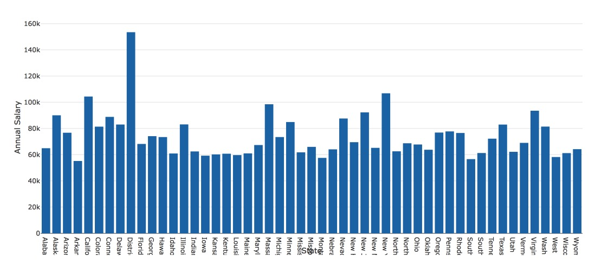

# Scraping and Parsing Income data from the Web

**Author:** Victoria Larson

__*Project Description:*__
My goal for this project was to parse income data from the website: http://livingwage.mit.edu/. I wanted to pull the Typical Annual Salaries Table for each state, load them into R and then analyze and manipulate the data from there. This project was mostly focused around building functions. I was able to build a function pull each website table quickly instead of doing each state one by one. Refer to Occupation_Scraping.R for all of my work.

Once I had loaded all of the data into R and had cleaned it up. I wanted to move on to the Exploratory Data Analysis Portion of the Sprint. Below are my questions and answers.

** Which field in which state has the highest paying job? **

|State|Occupational_Area|Annual_Salary|
|---|---|---|
|District of Columbia|Legal|$153,535|

** Use a bar plot to show and compare the Annual Salary for Legal jobs in every state? **

*Note:* Since District of Columbia is really only the size of a county - the fact that it is the state with the highest Annual Salary isn't really accurate. For future questions we will probably take it out. 
